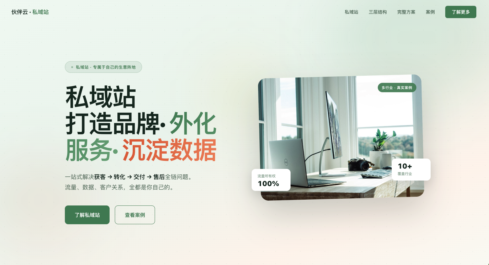

# hb-website-creator

> 为各行业客户快速生成专业静态营销网页的 Claude Code Skill，遵循伙伴云零代码设计规范，可一键部署至伙伴云平台。

[](https://site.huoban.com/siyuzhan)
点击图片查看详细介绍

## 概述
AI 建站工具可在 30 秒内生成网站，但数据显示 AI 生成的网站仅 **0.026%** 长期保持活跃。问题不在技术，在于**缺乏差异化和场景深度**。

本 Skill 通过系统化的定位方法论 + 27 种设计风格 + 反趋同案例库，解决这一问题。

**赢家公式 = 深度定位 + 场景专属设计 + 风格多样性**

注意：经过测试，目前只有 Claudecode 才能保证生成的效果，其他模型生成质量较差

## 触发词

当用户提到以下需求时，Skill 自动触发：

> "帮我做网页" · "创建落地页" · "做静态网站" · "生成品牌网页" · "做官网" · "做私域站" · "帮我把这份资料做成网站" · "把这个品牌做成落地页" · "做产品页" · "做作品集"

## 三种工作模式

| 模式 | 适用场景 | 轮次 |
|------|---------|------|
| **A. 快速模式** | 有基本资料或能用几句话说清楚 | ~3 轮 |
| **B. 标准模式** | 有现成文档/图片/链接，需设计文档确认 | ~5 轮 |
| **C. 深度模式** | 需系统梳理定位、品牌故事、竞争优势 | 完整六步流程 |

## 核心能力

- **35+ 站点类型**：企业官网、落地页、作品集、电商、社群、教育、活动报名……
- **15+ 行业垂直**：科技/SaaS、餐饮、时尚、教育、医疗、房地产、金融……
- **27 种设计风格**：简洁清爽、暗黑酷感、编辑杂志、高端奢华、多彩活力……
- **反趋同机制**：通过 10+ 真实案例库，确保每个网站有差异化设计方向
- **图片策略**：Unsplash 占位图 / 本地素材 / 混合方案，带替换标准
- **伙伴云部署**：生成 React + Less 架构（site-widget），可直接部署至伙伴云自定义组件

## 目录结构

```
hb-website-creator/
├── SKILL.md              # Skill 主文件（Claude Code 读取）
├── assets/
│   └── template/         # Vite + React 项目模板
│       ├── index.html
│       ├── package.json
│       └── vite.config.js
├── references/
│   ├── case-library.md   # 案例索引（反趋同检查用）
│   ├── design-guide.md   # 设计决策指南（五步方法论）
│   ├── technical-spec.md # 技术规范（React + Less 架构）
│   ├── cases/            # 10+ 真实项目案例详情
│   ├── combos/           # 8 种页面风格组合包
│   ├── styles/           # 设计风格库
│   └── interactions/     # 交互模式库（滚动、Tab、手风琴……）
├── CHANGELOG/            # 版本迭代记录
└── logo.html             # Skill 图标预览
```

## 安装

和Claudecode 说：帮我安装 skill（https://github.com/sunset2333/hb-website-creator/）

## 技术栈

生成的网站使用 **React + Less（site-widget 架构）**：

- 所有页面组件集中在 `widget.jsx`，通过 URL 参数路由
- 样式写在 `style.less`，作用域锁定在 `.site-widget` 选择器
- 本地预览：`npm install && npm run dev`（Vite，端口 3000）
- 部署：将构建产物上传至伙伴云自定义组件

## 版本记录

| 版本 | 主要变更 |
|------|---------|
| v1.51 | 修复 portal wrapper 导致首屏空白问题 |
| v1.5 | 增加设计规范和 demo 预览策略 |
| v1.4 | 增加图片素材策略 + 去 AI 味提示词 |
| v1.3 | 面向用户重新设计对话体验流程 |
| v1.2 | Token 用量及架构优化 |
| v1.1 | 合并 HTML 转伙伴云自定义组件能力 |

## License

MIT
